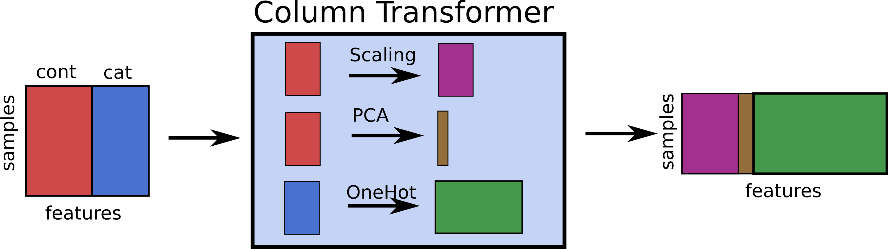

title: Intermediate Machine Learning with scikit-learn: Pandas Interoperability, Categorical Data, Parameter Tuning and Model Evaluation
use_katex: True
class: title-slide

# Intermediate Machine Learning with scikit-learn
## Pandas Interoperability, Categorical Data, Parameter Tuning and Model Evaluation


.larger[Thomas J. Fan]<br>
@thomasjpfan<br>
<a href="https://www.github.com/thomasjpfan" target="_blank"><span class="icon icon-github icon-left"></span></a>
<a href="https://www.twitter.com/thomasjpfan" target="_blank"><span class="icon icon-twitter"></span></a>
<a class="this-talk-link", href="https://github.com/thomasjpfan/ml-workshop-intermediate-v2" target="_blank">
This workshop on Github: github.com/thomasjpfan/ml-workshop-intermediate-v2</a>

---

name: table-of-contents
class: title-slide, left

# Table of Contents
.g[
.g-6[
1. [Pandas Interoperability](#pandas-interoperability)
1. [Categorical Data & Pandas Input](#categorical-data)
1. [Parameter Tuning](#parameter-tuning)
1. [Model Evaluation](#evaluation)
]
.g-6.g-center[

]
]

---

# Scikit-learn API

.center[
## `estimator.fit(X, [y])`
]

.g[
.g-6[
## `estimator.predict`
- Classification
- Regression
- Clustering
]
.g-6[
## `estimator.transform`
- Preprocessing
- Dimensionality reduction
- Feature selection
- Feature extraction
]
]

---

# Data Representation


---

# Supervised ML Workflow


---

name: pandas-interoperability
class: chapter-slide

# 1. Pandas Interoperability

.footnote-back[
[Back to Table of Contents](#table-of-contents)
]

---

# Transform outputs NumPy arrays by default

```python
from sklearn.preprocessing import StandardScaler

scaler = StandardScaler()
scaler.fit_transform(X_train)
```


---

# Configured for Pandas Output!

```python
*scaler.set_output(transform="pandas")
scaler.fit_transform(X_train)
```


---

# Imputers in scikit-learn

## Impute module

```py
from sklearn.impute import SimpleImputer
from sklearn.impute import KNNImputer

# `add_indicator=True` to add missing indicator
imputer = SimpleImputer(add_indicator=True)

from sklearn.experimental import enable_iterative_imputer
from sklearn.impute import IterativeImputer
```

---

# Comparing the Different methods


---

class: chapter-slide

# Notebook 📕!
## notebooks/01-pandas-output.ipynb

---

name: categorical-data
class: chapter-slide

# 2. Categorical Data & Pandas Input

.footnote-back[
[Back to Table of Contents](#table-of-contents)
]

---

# Categorical Data

## Examples of categories:

- `['Manhattan', 'Queens', 'Brooklyn', 'Bronx']`
- `['dog', 'cat', 'mouse']`

## Scikit-learn Encoders

`OrdinalEncoder`: Encodes categories into an integer
```py
from sklearn.preprocessing import OrdinalEncoder
```

`OneHotEncoder`: Encodes categories using a one-hot encoding scheme
```py
from sklearn.preprocessing import OneHotEncoder
```

---

class: chapter-slide

# Notebook 📔!
## notebooks/02-categorical-data.ipynb

---

# Heterogenous data

## Example: Titanic Dataset

<table border="1" class="dataframe">
  <thead>
    <tr style="text-align: right;">
      <th></th>
      <th>pclass</th>
      <th>sex</th>
      <th>age</th>
      <th>sibsp</th>
      <th>parch</th>
      <th>fare</th>
      <th>embarked</th>
      <th>body</th>
    </tr>
  </thead>
  <tbody>
    <tr>
      <th>0</th>
      <td>1.0</td>
      <td>female</td>
      <td>29.0000</td>
      <td>0.0</td>
      <td>0.0</td>
      <td>211.3375</td>
      <td>S</td>
      <td>NaN</td>
    </tr>
    <tr>
      <th>1</th>
      <td>1.0</td>
      <td>male</td>
      <td>0.9167</td>
      <td>1.0</td>
      <td>2.0</td>
      <td>151.5500</td>
      <td>S</td>
      <td>NaN</td>
    </tr>
    <tr>
      <th>2</th>
      <td>1.0</td>
      <td>female</td>
      <td>2.0000</td>
      <td>1.0</td>
      <td>2.0</td>
      <td>151.5500</td>
      <td>S</td>
      <td>NaN</td>
    </tr>
    <tr>
      <th>3</th>
      <td>1.0</td>
      <td>male</td>
      <td>30.0000</td>
      <td>1.0</td>
      <td>2.0</td>
      <td>151.5500</td>
      <td>S</td>
      <td>135.0</td>
    </tr>
    <tr>
      <th>4</th>
      <td>1.0</td>
      <td>female</td>
      <td>25.0000</td>
      <td>1.0</td>
      <td>2.0</td>
      <td>151.5500</td>
      <td>S</td>
      <td>NaN</td>
    </tr>
  </tbody>
</table>

---

# scikit-learn's ColumnTransformer



---

class: chapter-slide

# Notebook 📔!
## notebooks/02-categorical-data.ipynb

---


name: parameter-tuning
class: chapter-slide

# 3. Parameter Tuning

.footnote-back[
[Back to Table of Contents](#table-of-contents)
]

---

class: center

# Why Tune Parameters?


---

# Score vs n_neighbors


---

# Parameter Tuning Workflow


---

# GridSearchCV

```py
from sklearn.model_selection import GridSearchCV

param_grid = {'n_neighbors': np.arange(1, 30, 2)}
grid = GridSearchCV(KNeighborsClassifier(), param_grid=param_grid,
                    return_train_score=True)

grid.fit(X_train, y_train)
```

Best score

```py
grid.best_score_
```

Best parameters

```py
grid.best_params_
```

---

# Random Search


---

# RandomizedSearchCV with scikit-learn

```py
from scipy.stats import randint
param_dist = {
    "max_depth": randint(3, 9),
    "max_features": randint(1, 11)
}

random_search = RandomizedSearchCV(
    clf,
    param_distributions=param_dist,
    n_iter=20
)
```

- Values in `param_distributions` can be a list or an object from the
`scipy.stats` module

---

# Successive Halving

```python
from sklearn.experimental import enable_halving_search_cv  # noqa

from sklearn.model_selection import HalvingRandomSearchCV
from sklearn.model_selection import HalvingGridSearchCV
```

???

The search strategy starts evaluating all the candidates with a small amount of resources and iteratively selects the best candidates, using more and more resources.

---

class: center


---

class: chapter-slide

# Notebook 📓!
## notebooks/03-parameter-tuning.ipynb

---

name: evaluation
class: chapter-slide

# 4. Model Evaluation

.footnote-back[
[Back to Table of Contents](#table-of-contents)
]

---

# How we were evaluating so far?
## Classification uses accuracy

```py
from sklearn.linear_model import LogisticRegression

lr = LogisticRegression().fit(X_train, y_train)

*lr.score(X_test, y_test)
```

## Regression uses coefficient of determination (R^2)

```py
from sklearn.tree import DecisionTreeRegressor

tree = DecisionTreeRegressor().fit(X_train, y_train)

*tree.score(X_test, y_test)
```

---

class: chapter-slide

# Metrics for Binary Classification

---

# Positive or Negative class?

.g.g-middle[
.g-4[

]
.g-4[

]
.g-4[

]
]

## Arbitrary decision but is often the minority class

---

class: center

# Confusion Matrix


$$
\text{Accuracy} = \frac{TP + TN}{TP + TN + FP + FN}
$$

---

# Confusion Matrix in scikit-learn

```python
from sklearn.metrics import confusion_matrix

lr = LogisticRegression().fit(X_train, y_train)
y_pred = lr.predict(X_test)

*confusion_matrix(y_test, y_pred)

# array([[50,  3],
#        [ 3, 87]])
```

---

# Plotting the confusion matrix

```python
from sklearn.metrics import ConfusionMatrixDisplay

*ConfusionMatrixDisplay.from_estimator(lr, X_test, y_test)
```


---

# Other Common Metrics
## Precision, Recall, f-score

.g[
.g-4[
$$
\text{precision} = \frac{TP}{TP + FP}
$$

$$
\text{recall} = \frac{TP}{TP + FN}
$$

$$
\text{F} = 2 \frac{\text{precision}\cdot\text{recall}}{\text{precision} + \text{recall}}
$$
]
.g-8[

]
]

---

# Averaging strategies

```py
y_true = [1, 0, 0, 0, 0, 0, 0, 1]
y_pred = [1, 1, 1, 1, 0, 0, 1, 0]
```

```py
recall_score(y_true, y_pred, pos_label=1)
# 0.5

recall_score(y_true, y_pred, pos_label=0)
# 0.333333333333
```

.g[
.g-6[
## `macro`

$\frac{1}{2}\left(\frac{1}{2} + \frac{1}{3}\right) = \frac{5}{12}$
```py
recall_score(y_true, y_pred,
             average='macro')
# 0.416666666
```
Interested in the minority class
]
.g-6[
## `weighted`
$\frac{1}{8}\left(2\cdot\frac{1}{2} + 6\cdot\frac{1}{3}\right) = \frac{3}{8}$
```py
recall_score(y_true, y_pred,
             average='weighted')
# 0.375
```
Adds more weight the the majority class
]
]

---

# Classification Report

```py
from sklearn.metrics import classification_report

y_true = [1, 0, 0, 0, 0, 0, 0, 1]
y_pred = [1, 1, 1, 1, 0, 0, 1, 0]

print(classification_report(y_true, y_pred))
```

```
              precision    recall  f1-score   support

           0       0.67      0.33      0.44         6
           1       0.20      0.50      0.29         2

    accuracy                           0.38         8
   macro avg       0.43      0.42      0.37         8
weighted avg       0.55      0.38      0.40         8
```

---

class: chapter-slide

# Notebook 📓!
## notebooks/04-model-evaluation.ipynb

---

# Scikit-learn prediction API

### Predicting classes

```py
log_reg.predict(X_test)
# [0, 1, 0, 0, ...]
```

### Predicting probabilities

```py
log_reg.predict_proba(X_test)
# array([[0.7, 0.3],
#        [0.1, 0.9],
#        [0.8, 0.2]])
```

### Decision function

```py
log_reg.decision_function(X_test)
# array([-1.203, 4.291, -2.745]
```

---

# Changing Thresholds

.g[
.g-8[
.smaller-x[
```py
y_pred = log_reg.predict(X_test)
print(classification_report(y_test, y_pred))
```

```
              precision    recall  f1-score   support

       False       0.99      1.00      0.99      2731
        True       0.75      0.37      0.49        65

    accuracy                           0.98      2796
   macro avg       0.87      0.68      0.74      2796
weighted avg       0.98      0.98      0.98      2796
```

```py
y_pred_20 = log_reg.predict_proba(X_test)[:, 1] > 0.25
print(classification_report(y_test, y_pred_20))
```

```
              precision    recall  f1-score   support

       False       0.99      0.99      0.99      2731
        True       0.63      0.55      0.59        65

    accuracy                           0.98      2796
   macro avg       0.81      0.77      0.79      2796
weighted avg       0.98      0.98      0.98      2796
```
]
]
.g-4[
$$
\text{precision} = \frac{TP}{TP + FP}
$$

$$
\text{recall} = \frac{TP}{TP + FN}
$$
]
]

---

# Precision recall curve

```py
from sklearn.metrics import PrecisionRecallDisplay
PrecisionRecallDisplay.from_estimator(
    log_reg, X_test, y_test, name="LogisticRegression")
```

.g[
.g-8[

]
.g-4[
$$
\text{precision} = \frac{TP}{TP + FP}
$$

$$
\text{recall} = \frac{TP}{TP + FN}
$$
]
]

---

# Average Precision

$$
\text{AveP} = \sum_{k=1}^n P(k)\Delta r(k)
$$

.center[

]

---

# ROC Curve (Receiver Operating Characteristic)

```py
from sklearn.metrics import RocCurveDisplay
RocCurveDisplay.from_estimator(log_reg, X_test, y_test, name="LogisticRegression")
```

.g[
.g-8[

]
.g-4[
$$
\text{TPR} = \frac{TP}{TP + FN}
$$
$$
\text{FPR} = \frac{FP}{FP + TN}
$$
]
]

---

# Both Curves


---

class: chapter-slide

# Notebook 📓!
## notebooks/04-model-evaluation.ipynb

---

class: middle

# Post-hoc Model Interpretation

- Not inference
- Not causality
- Explaining the model != explaining the data
- Model inspection only tells you about the model
- Useful only if the model is good

---

class: middle

# Post-hoc Model Interpretation

## Inspection based on model
- Interpreting the coefficients in a linear model: `coef_`
- `feature_importances_` of a random forest

## Model-agnostic
- Permutation importance
- Partial dependence curves

---

# Permutation Feature Importance 👑 (Pt 1)

```py
X_train = [
    [0, 1, 2],
    [1, 2, 3],
    [2, 1, 4],
    [3, 1, 9],
    [4, 3, 1]
]
y_train = [1, 0, 1, 1, 0]

model.fit(X_train, y_train)
model.score(X_train, y_train)
# 0.90
```

---

# Permutation Feature Importance 👑 (Pt 2)

```py
X_train_perm_1 = [
    [1, 1, 2],
    [0, 2, 3],
    [2, 1, 4],
    [4, 1, 9],
    [3, 3, 1]
]
model.score(X_train_perm_1, y_train)
# 0.70
```

---

# Permutation Feature Importance 👑 (Pt 3)

```py
X_train_perm_2 = [
    [1, 1, 2],
    [3, 2, 3],
    [4, 1, 4],
    [2, 1, 9],
    [0, 3, 1]
]
model.score(X_train_perm_1, y_train)
# 0.73
```

---

# Permutation Feature Importance 👑 (Pt 4)

```py
model.score(X_train_perm_3, y_train)
# 0.80
```

- Remember: `model.score(X_train, y_train) = 0.90`
- permutation feature importance for the 1st feature:

```py
[0.90 - 0.70, 0.90 - 0.73, 0.90 - 0.80]
# [0.20, 0.17, 0.10]
```

---

# Permutation Feature Importance 👑 (Pt 5)

```py
from sklearn.inspection import permutation_importance

result = permutation_importance(model, X, y, n_repeats=3)

result['importances']
# [[0.20, 0.17, 0.10], [0.5, 0.4, 0.6], ...]
result['importances_mean']
# [ 0.157, 0.5, ...]
result['importances_std']
# [0.0419 0.0816, ...])
```

---

class: chapter-slide

# Notebook 📓!
## notebooks/04-model-evaluation.ipynb

---

# Partial Dependence Plots (Pt 1)

```py
X_train = [
    [0, 1, 2],
    [1, 2, 3],
    [2, 4, 4],
    [3, 1, 9],
    [4, 3, 1]
]
y_train = [0.1, 0.2, 0.3, 0.4, 0.5]

model.fit(X_train, y_train)
```

---

# Partial Dependence Plots (Pt 2)

```py
X_train_0 = [
    [0, 1, 2],
    [0, 2, 3],
    [0, 4, 4],
    [0, 1, 9],
    [0, 3, 1]
]
model.predict(X_train_0).mean()
# 0.1
```

---

# Partial Dependence Plots (Pt 3)

```py
X_train_1 = [
    [1, 1, 2],
    [1, 2, 3],
    [1, 4, 4],
    [1, 1, 9],
    [1, 3, 1]
]
model.predict(X_train_1).mean()
# 0.24
```

---

# Partial Dependence Plots (Pt 4)

.g[
.g-6[
```py
model.predict(X_train_0).mean()
# 0.1

model.predict(X_train_1).mean()
# 0.24

model.predict(X_train_2).mean()
# 0.5

...
```
]
.g-6[

]
]

---

# Partial Dependence Plots in scikit-learn

```py
from sklearn.inspection import PartialDependenceDisplay

PartialDependenceDisplay.from_estimator(estimator, X, features)
```


---

class: chapter-slide

# Notebook 📓!
## notebooks/04-model-evaluation.ipynb

---

# Closing

.g.g-middle[
.g-6[

1. [Pandas Interoperability](#pandas-interoperability)
1. [Categorical Data & Pandas Input](#categorical-data)
1. [Parameter Tuning](#parameter-tuning)
1. [Model Evaluation](#evaluation)
]
.g-6.center[
<br>
.larger[Thomas J. Fan]<br>
@thomasjpfan<br>
<a href="https://www.github.com/thomasjpfan" target="_blank"><span class="icon icon-github icon-left"></span></a>
<a href="https://www.twitter.com/thomasjpfan" target="_blank"><span class="icon icon-twitter"></span></a>
<a class="this-talk-link", href="https://github.com/thomasjpfan/ml-workshop-intermediate-v2" target="_blank">
This workshop on Github: github.com/thomasjpfan/ml-workshop-intermediate-v2</a>
]
]
